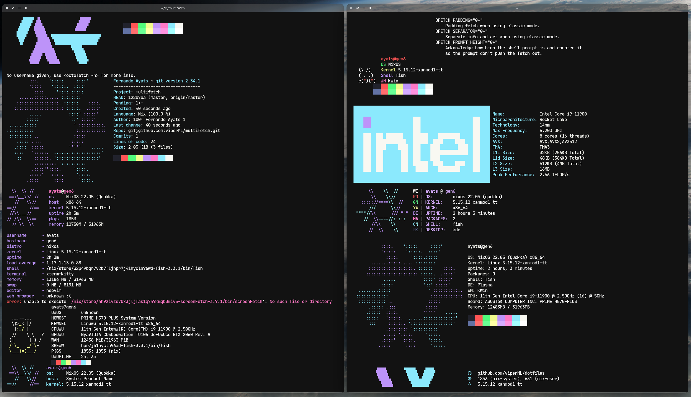

<h1 align="center">multifetch</h1>

<h4 align="center">one fetch to rule them all</h1>

Only compatible with Nix. It will read all the "fetchers" applications in nixpkgs and run them all.

Usage:

```
nix run github:viperML/multifetch
```


<!-- Insert image multifetch.png centered -->

<div align="center">
  <div style="display: flex; align-items: flex-start;">
    
  </div>
</div>
